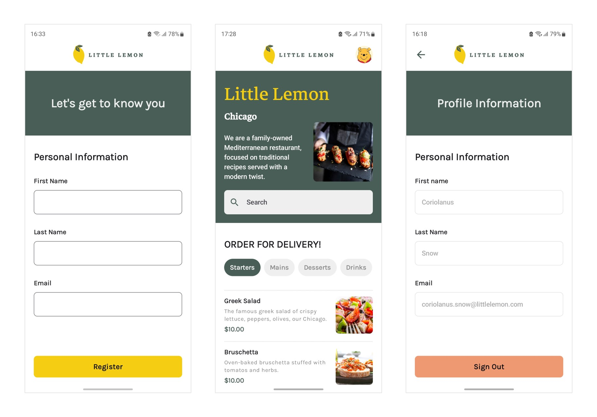

# Meta Android Developer Capstone Project

This project is the capstone project for the **Meta Android Developer Professional Certificate**, developed as a complete mobile solution for **Little Lemon**, a Mediterranean restaurant. The app showcases modern Android development practices by integrating local persistence, remote data handling, and user state management within a clean architectural design. It emphasizes responsive UI, intuitive navigation, and an engaging user experience, reflecting the core skills and concepts gained throughout the professional certification program.


## Project Highlights

- **Offline-First Caching**: Menu data is retrieved from a remote JSON resource on first launch and cached in a local relational store to ensure offline functionality.
- **Modern UI**: A consistent and accessible interface is maintained across all screens with responsive layouts.
- **Reactive State Management**: The interface is automatically updated in response to persistent state changes and database updates.
- **Lightweight Networking and Parsing**: A compact HTTP client and JSON mapping are employed for efficient remote data retrieval.
- **Local Preferences**: Onboarding state and user profile details are securely managed through robust local storage.
- **Efficient Image Handling**: Remote images are rendered with caching to provide smooth and fast-loading visuals.


## Table of Contents

- [Project Overview](#project-overview)
- [Features](#features)
- [Technologies Used](#technologies-used)
- [App Architecture and Data Flow](#app-architecture-and-data-flow)
- [Setup Instructions](#setup-instructions)
- [Source Files and Components](#source-files-and-components)
- [Behavioral Notes and Edge Cases](#behavioral-notes-and-edge-cases)
- [License](#license)


## Project Overview

The **Little Lemon** Android application was developed as the final capstone project for the **Meta Android Developer Professional Certificate**. The project consolidates the core skills acquired throughout the specialization, including UI development, local persistence, remote networking, and state management. The app enables users to explore the restaurant’s menu, filter and search items, manage preferences, and maintain a personalized profile, all within a clean and responsive interface. By combining offline-first caching, efficient networking, and modern design principles, the application demonstrates how production-ready mobile solutions can be built to deliver a seamless user experience.

[](./docs/screenshots/)


## Features

- **Onboarding Flow**: Guides new users through an introduction before accessing the app.
- **Dynamic Menu Display**: Presents the Little Lemon menu with search and category-based filtering.
- **Offline Functionality**: Ensures the menu remains available even without an internet connection.
- **Profile Management**: Allows users to view personal details.
- **State Persistence**: Retains user preferences and session data across app restarts.
- **Efficient Image Rendering**: Delivers smooth visuals with cached remote images.
- **Seamless Navigation**: Provides intuitive transitions between onboarding, home, and profile screens.


## Technologies Used

- **Kotlin**: Core language for app development.
- **Jetpack Compose**: Framework for building responsive and declarative UIs.
- **Room**: Local relational database for caching menu and user data.
- **DataStore**: Persistent storage for user preferences and onboarding state.
- **Ktor**: Lightweight HTTP client for fetching remote JSON resources.
- **Glide**: Image loading library for efficient remote image rendering with caching.
- **Navigation Component**: Handles in-app navigation between screens.
- **ViewModel and StateFlow**: Reactive state management to synchronize UI with data changes.


## App Architecture and Data Flow

The app is implemented using **MVVM (Model–View–ViewModel)** architecture with **Jetpack Compose** for UI and **Room** for persistence.

#### Architecture Overview
- **Model**
  - Room entities and DAO manage local storage of menu items and onboarding state.
  - Ktor client handles remote API requests.

- **View (Jetpack Compose UI)**
  - Observes ViewModel state.
  - Renders screens (Onboarding, Home, Menu, Search, Profile).
  - Displays toasts for network errors and user feedback.

- **ViewModel**
  - Provides state to the UI using LiveData/StateFlow.
  - Synchronizes remote data with the **SharedPreferences**.

#### Data Flow
- **Startup**
  - On launch, the onboarding state is retrieved from local storage.
  - If the user has completed onboarding, the Home screen is displayed.
  - If the user has not completed onboarding, the Onboarding screen is displayed.

- **Menu Synchronization**
  - The app checks Room for existing menu data.
  - If no data exists, the menu JSON is fetched using the Ktor client and persisted in Room.
  - The UI observes Room and updates automatically.

- **Search and Filtering**
  - Search and filtering are performed client-side for responsiveness.
  - The UI reflects queries and filters immediately.

- **Error Handling**
  - If a network request fails, a toast is displayed with connectivity error message.
  - If any text input is invalid, a toast is displayed with error message.
  - If remote images fail to load, text content is still displayed.

- **Onboarding State**
  - Onboarding completion is stored as a flag in **SharedPreferences**.
  - The value is parsed as a boolean when retrieved.
  - Signing out from the Profile screen resets onboarding state, resulting in redirection to the Onboarding screen.


## Setup Instructions

1. Prerequisites:

   Ensure **Android Studio Meerkat Feature Drop** or later is installed, with **JDK 17** configured.

2. Clone the repository:
   ```bash
   git clone https://github.com/TANMOY-TRC/Meta-Android-Developer-Capstone.git
   ```

3. Navigate to the project directory:
   ```bash
   cd Meta-Android-Developer-Capstone
   ```

4. Open the project in Android Studio:

   Ensure the following SDK versions are configured:
   - **Compile SDK Version**: 36
   - **Minimum SDK Version**: 24
   - **Target SDK Version**: 36

   Android Studio should automatically prompt to **Sync Gradle**. If not, select **File > Sync Project with Gradle Files**.

5. Build and Run the app:

   Click **Run** in Android Studio to build and launch the app on an emulator or connected device.


## Source Files and Components

The main source code files of the project are presented below, along with the responsibilities they serve.

```plaintext
com.example.littlelemon
├── data
│   ├── local
│   │   ├── Database.kt                   # Room database setup
│   │   ├── DatabaseProvided.kt           # Provides database instance
│   │   └── UserPreferences.kt            # Stores onboarding profile info
│   └── remote
│       ├── ApiService.kt                 # API endpoint with fetch method
│       └── Network.kt                    # Network models; map JSON to DB
├── navigation
│   ├── Destinations.kt                   # Defines navigation destinations
│   └── Navigation.kt                     # Handles app navigation flow
├── ui
│   ├── components
│   │   ├── Header.kt                     # Top Bar component
│   │   ├── MenuItemRow.kt                # Menu item row layout
│   │   ├── MultiSelectFilterButtons.kt   # Category filter buttons
│   │   └── SearchBar.kt                  # Search input component
│   ├── screens
│   │   ├── Home.kt                       # Home screen with menu listing
│   │   ├── Loading.kt                    # Loading indicator screen
│   │   ├── Onboarding.kt                 # Onboarding flow
│   │   └── Profile.kt                    # User profile screen
│   ├── theme
│   │   ├── Color.kt                      # App color definitions
│   │   ├── Shape.kt                      # UI element shapes
│   │   ├── Theme.kt                      # App theme setup
│   │   └── Typography.kt                 # Fonts and text styles
│   └── AppScreen.kt                      # Main app UI container
├── viewmodel
│   └── UserViewModel.kt                  # Holds persistent user state
└── MainActivity.kt                       # Launches app, hosts main navigation
```


## Behavioral Notes and Edge Cases

- **Initial Synchronization**: On app startup, the local storage is checked for existing menu data; if none exists, the remote JSON is fetched and saved. Network failures result in an empty list, and a toast notification is displayed to inform the user of connectivity issues.
- **Data Consistency**: Database writes are performed off the main thread to maintain UI responsiveness. Observed persisted data automatically updates the UI.
- **Search and Filtering**: Client-side filtering is applied for instant results. For large datasets, server-side filtering and pagination may be required.
- **Onboarding Storage**: Onboarding state is stored as a string and parsed to a boolean when read. Using typed storage is recommended for improved reliability.
- **Images**: Remote images are cached by the image loader. If an image fails to load, the textual content of the list remains visible.


## License

This project is licensed under the [MIT License](./LICENSE).
